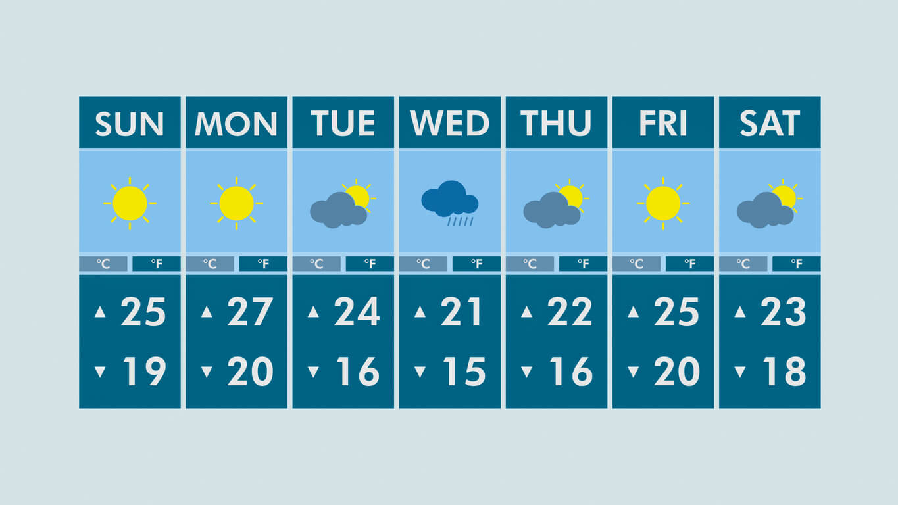
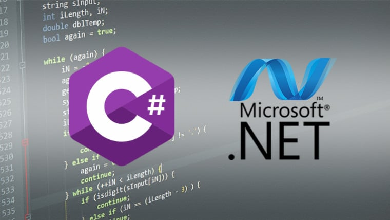

## Software Engineer | Software Developer | Web Developer 

Software Developer with a strong affinity for C# and the .NET ecosystem. I specialize in building both front- and back-end solutions. I work with technologies like ASP.NET Core and Angular, utilizing modern tools like Entity Framework for database management and Visual Studio as my preferred development environment. Additionally, I have experience working with Git and GitHub for version control, allowing me to collaborate efficiently on projects of any scale. I also have experience developing in other languages, allowing me to adapt to different needs and technologies depending on the project.

<h2>Database</h2>

<h2>BackEnd</h2>

<h2>FrontEnd</h2>

<h2>Cloud</h2>

<h2>Version Control</h2> 

<h2>IDE</h2> 

<h2>Game Code</h2> 

## Projects

<table>
  <tr>
    <td>
      
    </td>
    <td>
      <h3>Weather Web</h3>
      
Weather Web in Html, Css, Tailwind, Javascript

      <strong>Technologies:</strong> 
       
      <a href="https://weatherstation787.netlify.app">View project</a>
    </td>
  </tr>
  <tr>
    <td>
      
    </td>
    <td>
      <h3>Feature Extract Data</h3>
      
Feature Extract Data Excel to Sql

      <strong>Technologies:</strong> 
       
      <a href="https://github.com/layalarosa/Files">View project</a>
    </td>
  </tr>
  <tr>
    <td>
      
    </td>
    <td>
      <h3>Web Store</h3>
      
Web Application MVC

      <strong>Technologies:</strong> 
       
       
      <a href="https://github.com/layalarosa/WebShop">View project</a>
    </td>
  </tr>
</table>

     

