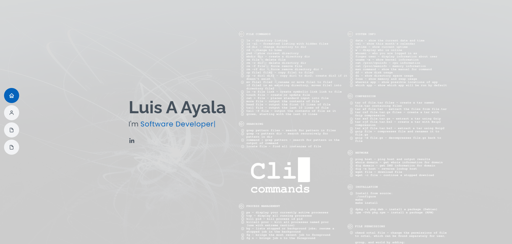
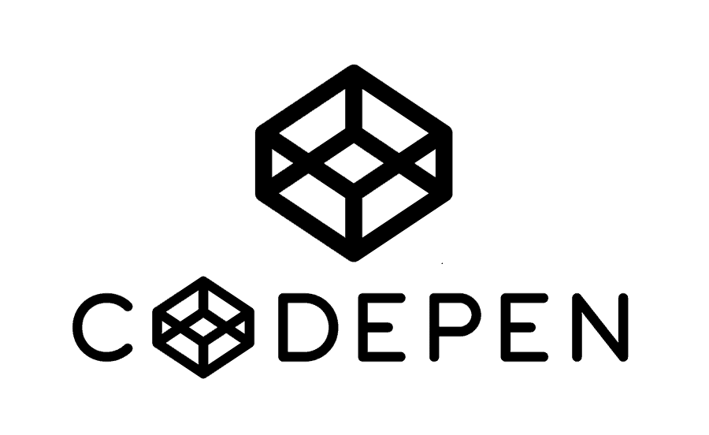

## Software Developer | Backend Developer | Frontend Developer 

Full-Stack Developer with a passion for C# and .NET
Hi! I'm a Full-Stack software and web developer with a strong affinity for C# and the .NET ecosystem. I specialize in building robust and scalable solutions, both on the frontend and backend. Currently, I work with technologies such as ASP.NET Core and Angular, leveraging modern tools like Entity Framework for database management, and Visual Studio as my preferred development environment. Additionally, I have experience with version control in Git and GitHub, which allows me to efficiently collaborate on projects of different scales.

<h2>FrontEnd</h2>

<h2>BackEnd</h2>

<h2>Cloud</h2>

<h2>Version Control</h2> 

<!--

-->

## Projects

<table>
  <tr>
    <td>
      
    </td>
    <td>
      <h3>Portfolio</h3>
      
Portfolio

      <strong>Technologies:</strong> 
       
      <a href="https://professionalportfolio2024.netlify.app/">View project</a>
    </td>
  </tr>
  <tr>
    <td>
      
    </td>
    <td>
      <h3>Web Store</h3>
      
Web Application MVC

      <strong>Technologies:</strong> 
       
       
      <a href="https://github.com/layalarosa/WebShop">View project</a>
    </td>
  </tr>
  <tr>
    <td>
      
    </td>
    <td>
      <h3>Weather App</h3>
      
Weather App in Html, Css, Javascript

      <strong>Technologies:</strong> 
       
      <a href="https://github.com/layalarosa/Vanilla_Weather_App">View project</a>
    </td>
  </tr>
  <tr>
    <td>
      
    </td>
    <td>
      <h3>Extract Data</h3>
      
Extract Data Excel to Sql (Source Code in Github)

      <strong>Technologies:</strong> 
       
      <a href="https://github.com/layalarosa/Files">View project</a>
    </td>
  </tr>
  <tr>
    <td>
      
    </td>
    <td>
      <h3>Crud</h3>
      
Crud in Html, Css, Typescript

      <strong>Technologies:</strong> 
       
      <a href="https://codepen.io/LayalaDev/full/wvRxgzp">View project</a>
    </td>
  </tr>
  <tr>
    <td>
      
    </td>
    <td>
      <h3>Ticket Manager</h3>
      
Ticket Manager in Html, Css, Typescript

      <strong>Technologies:</strong> 
       
      <a href="https://codepen.io/LayalaDev/full/GRPXPxG">View project</a>
    </td>
  </tr>
</table>

</table>
<!--- stats (end) -->

<!--- trophy (start) -->
<!--

  

-->
<!--- trophy (start) -->

        
<!--- stats (end) -->
