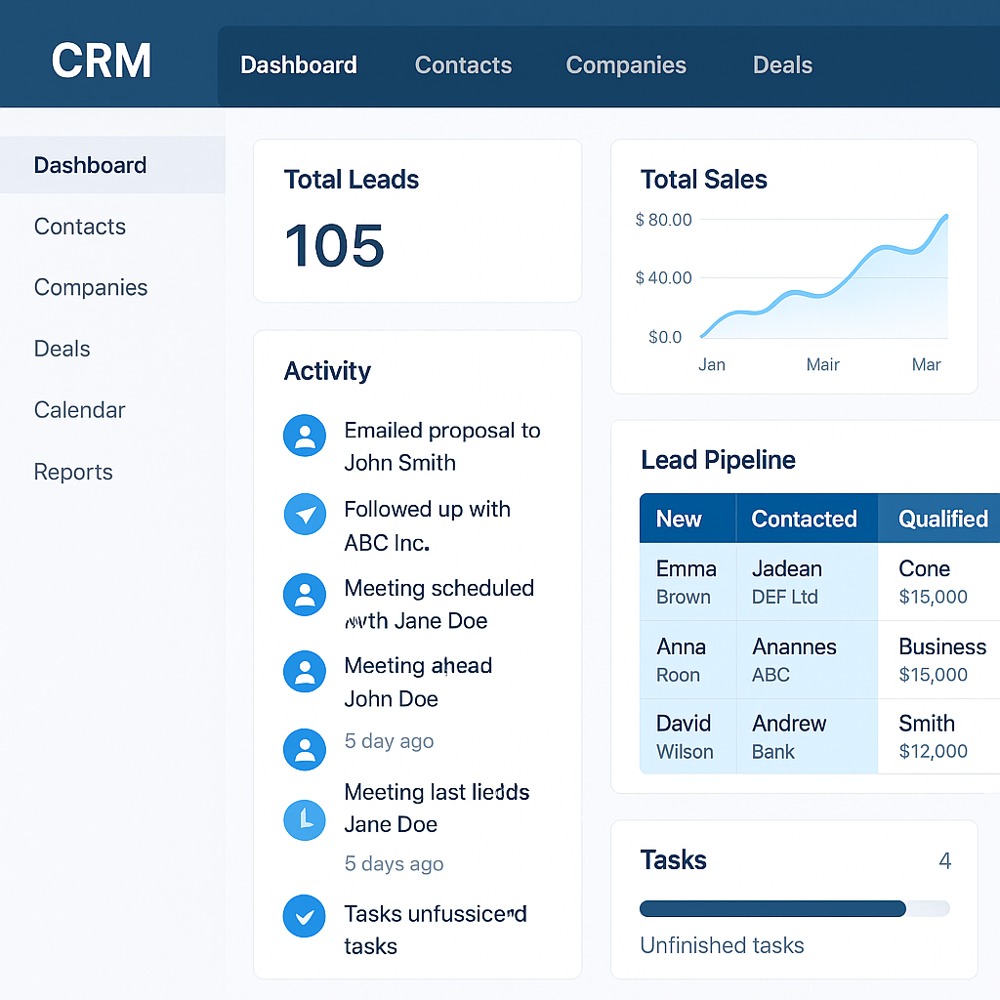

## Software Engineer | Software Developer | Web Developer 

I'm a developer specializing in creating front-end and back-end solutions, using modern tools for efficient database management.
I have experience with Git and GitHub for version control, which allows me to collaborate in an agile and organized manner on projects of any size. Additionally, I've worked with various programming languages, which gives me the ability to adapt to different technologies and requirements according to the needs of the project.

<h2>Database</h2>

<h2>BackEnd</h2>

<h2>FrontEnd</h2>

<h2>Cloud</h2>

<h2>Version Control</h2> 

<h2>IDE</h2> 

<h2>Game Code</h2> 

## Projects

<table>
  <tr>
    <td>
      
    </td>
    <td>
      <h3>Seo Saas</h3>
      
Saas React, Tailwind, Typescript

      <strong>Technologies:</strong> 
       
    </td>
  </tr>
  <tr>
    <td>
      
    </td>
    <td>
      <h3>Lyra Crm Saas</h3>
      
Saas React, Tailwind, Typescript

      <strong>Technologies:</strong> 
       
      <a href="https://lyra-crm.com/">View</a>
    </td>
  </tr>
  <tr>
    <td>
      
    </td>
    <td>
      <h3>Massage Web</h3>
      
Weather Web in Html, Css, Tailwind, Javascript

      <strong>Technologies:</strong> 
       
      <a href="https://damianmassage.com/">View</a>
    </td>
  </tr>
  <tr>
    <td>
      
    </td>
    <td>
      <h3>Extract Data</h3>
      
Feature Extract Data Excel to Sql

      <strong>Technologies:</strong> 
       
      <a href="https://github.com/layalarosa/Files">View project</a>
    </td>
  </tr>
  <tr>
    <td>
      
    </td>
    <td>
      <h3>Ecommerce</h3>
      
Web Application MVC

      <strong>Technologies:</strong> 
       
       
      <a href="https://github.com/layalarosa/WebShop">View project</a>
    </td>
  </tr>
  <tr>
    <td>
      
    </td>
    <td>
      <h3>Porfolio</h3>
      
Web

      <strong>Technologies:</strong> 
       
       
      <a href="https://layalarosa.net">View</a>
    </td>
  </tr>
</table>

     

