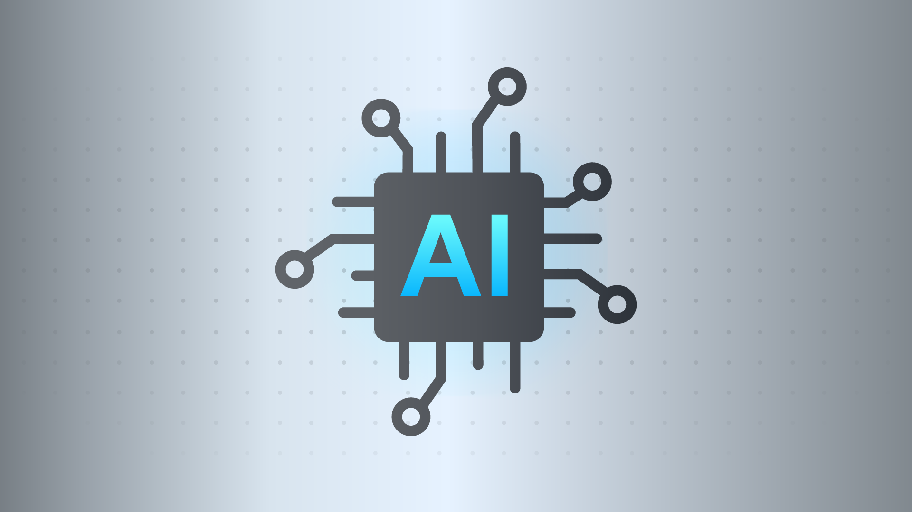
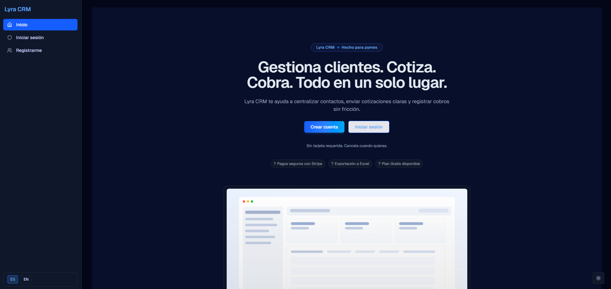
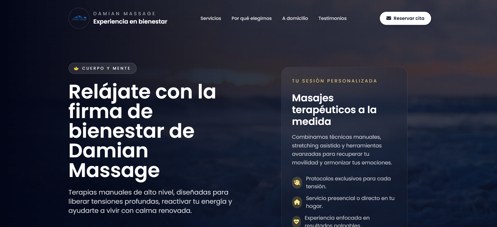
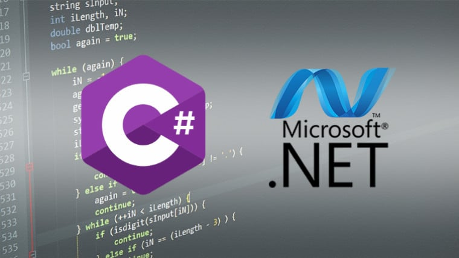

## Software Engineer | Software Developer | Web Developer 

Soy desarrollador especializado en la creación de soluciones front-end y back-end, utilizando herramientas modernas para la gestión eficiente de bases de datos. Tengo experiencia con Git y GitHub para el control de versiones, lo que me permite colaborar de forma ágil y organizada en proyectos de cualquier tamaño. Además, he trabajado con diversos lenguajes de programación, lo que me permite adaptarme a diferentes tecnologías y requisitos según las necesidades del proyecto.

He desarrollado múltiples aplicaciones enfocadas en resolver problemas reales de negocio, automatizar procesos y mejorar la presencia digital de empresas.

## Plataforma SEO SaaS

Sistema web para análisis y optimización SEO que permite:

Analizar palabras clave

Auditar sitios web

Monitorear posiciones en buscadores

Ideal para agencias o negocios que desean mejorar su visibilidad online.

## Sistema CRM (Lyra CRM)

Plataforma para gestionar:

Clientes

Cotizaciones

Información administrativa

Permite centralizar la operación del negocio en una sola herramienta.

## Automatización de Datos

Sistema que convierte datos de Excel en información estructurada dentro de bases de datos SQL, reduciendo errores manuales y tiempo operativo.

## Ecommerce Web

Aplicación web para venta de productos con estructura organizada y escalable.

## Desarrollo Web Corporativo

Creación de sitios web profesionales:

Diseño moderno

Responsive

Optimización básica para buscadores

Enfoque en conversión

<h2>Database</h2>

<h2>BackEnd</h2>

<h2>FrontEnd</h2>

<h2>Cloud and Deploy</h2>

<h2>Version Control</h2> 

<h2>IDE</h2> 

<h2>Game Code</h2> 

## Projects

<table>
  <tr>
    <td>
      
    </td>
    <td>
      <h3>Fishin Sentinel Saas</h3>
      
Saas python, postgres, supabase

      <strong>Technologies:</strong> 
       
    </td>
  </tr>
  <tr>
    <td>
      
    </td>
    <td>
      <h3>Seo Saas</h3>
      
Saas React, Tailwind, Typescript, nextjs, postgres, supabase

      <strong>Technologies:</strong> 
       
    </td>
  </tr>
  <tr>
    <td>
      
    </td>
    <td>
      <h3>Lyra Crm Saas</h3>
      
Saas React, Tailwind, Typescript, nextjs, postgres, supabase

      <strong>Technologies:</strong> 
       
      <a href="https://lyra-crm.com/">View</a>
    </td>
  </tr>
  <tr>
    <td>
      
    </td>
    <td>
      <h3>Web</h3>
      
Web in Html, Css, Tailwind, Javascript

      <strong>Technologies:</strong> 
       
      <a href="https://damianmassage.com/">View</a>
    </td>
  </tr>
  <tr>
    <td>
      
    </td>
    <td>
      <h3>Extract Data</h3>
      
Feature Extract Data Excel to Sql

      <strong>Technologies:</strong> 
       
      <a href="https://github.com/layalarosa/Files">View project</a>
    </td>
  </tr>
  <tr>
    <td>
      
    </td>
    <td>
      <h3>Ecommerce</h3>
      
Web Application MVC

      <strong>Technologies:</strong> 
       
       
      <a href="https://github.com/layalarosa/WebShop">View project</a>
    </td>
  </tr>
  <tr>
    <td>
      
    </td>
    <td>
      <h3>Porfolio</h3>
      
Web in Html, Css, Tailwind, Javascript

      <strong>Technologies:</strong> 
       
       
      <a href="https://layalarosa.net">View</a>
    </td>
  </tr>
</table>

     

